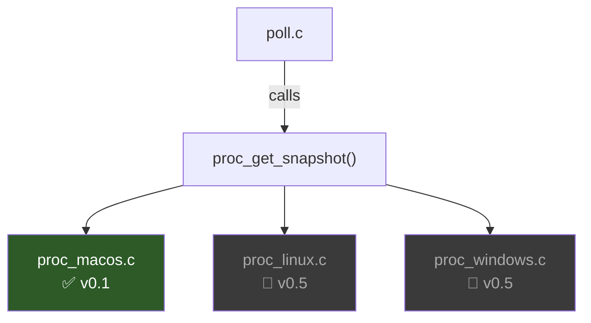
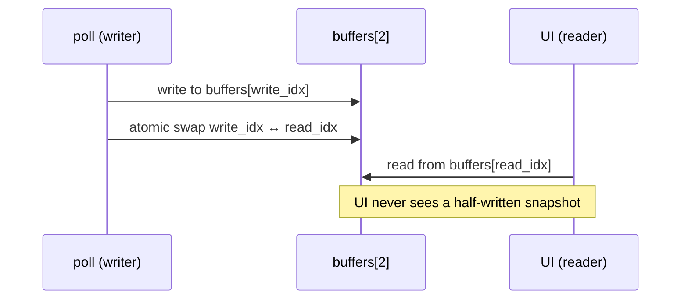
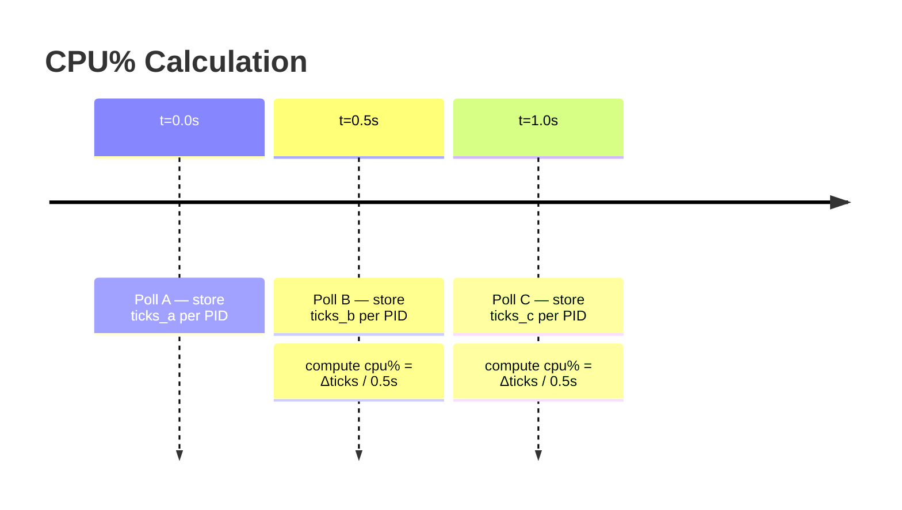
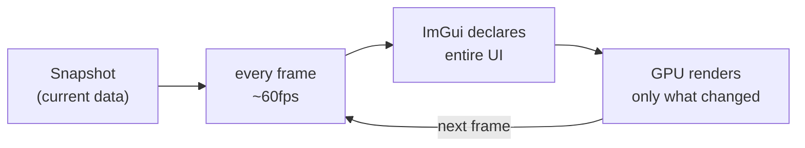
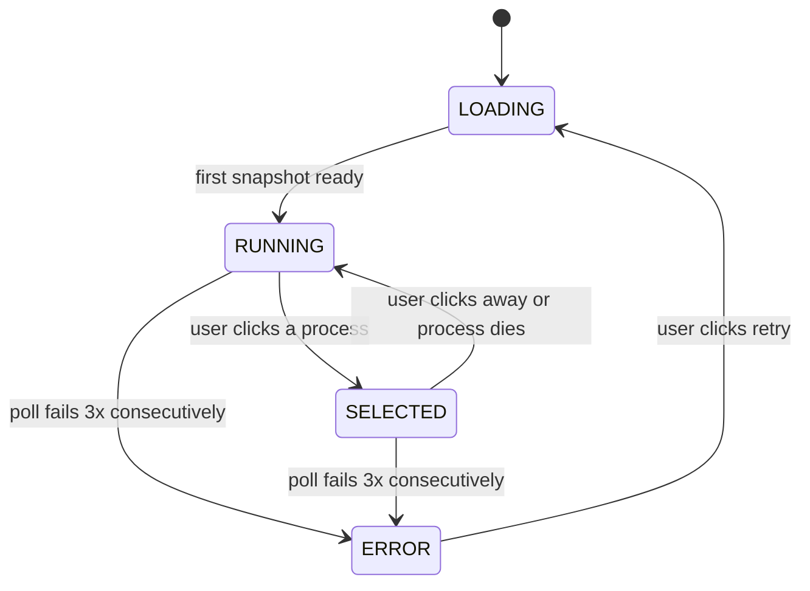
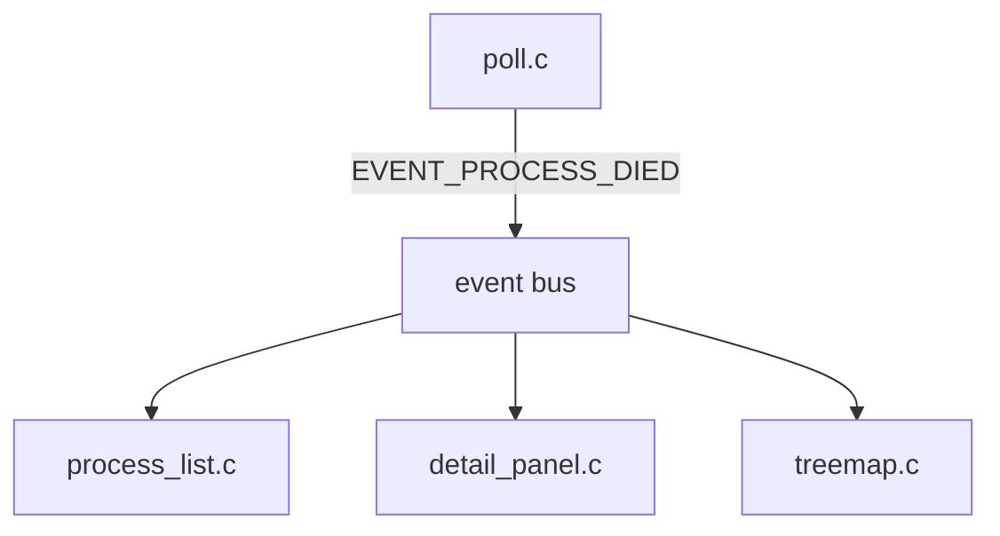
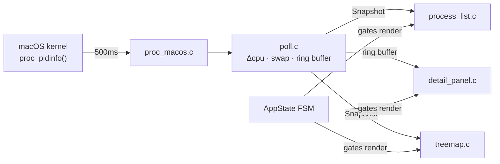
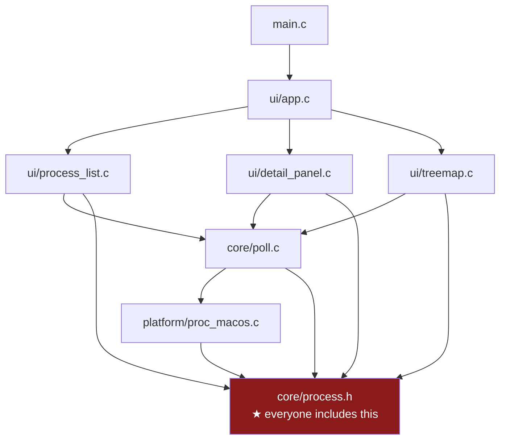

# PulsOS — Architecture Decision Record

> A living document. Every design choice here was made consciously.
> Read this when you're confused about *why* something is the way it is.
> The rejected patterns section is just as important as the active ones — knowing what you didn't do and why is real architecture thinking.

---

## Table of Contents

- [PulsOS — Architecture Decision Record](#pulsos--architecture-decision-record)
  - [Table of Contents](#table-of-contents)
  - [System Overview](#system-overview)
  - [Active Patterns](#active-patterns)
    - [1. Platform Abstraction Layer (PAL)](#1-platform-abstraction-layer-pal)
    - [2. Double Buffering](#2-double-buffering)
    - [3. Snapshot + Delta for CPU%](#3-snapshot--delta-for-cpu)
    - [4. Ring Buffer for History](#4-ring-buffer-for-history)
    - [5. Immediate Mode UI (Dear ImGui)](#5-immediate-mode-ui-dear-imgui)
    - [6. Finite State Machine](#6-finite-state-machine)
  - [Rejected Patterns](#rejected-patterns)
    - [Entity-Component System (ECS)](#entity-component-system-ecs)
    - [Observer / Event Bus](#observer--event-bus)
    - [Command Pattern](#command-pattern)
    - [Plugin / Panel Registry](#plugin--panel-registry)
    - [Push Model (kqueue)](#push-model-kqueue)
  - [Data Flow](#data-flow)
  - [Threading Model](#threading-model)
  - [File Dependency Graph](#file-dependency-graph)

---

## System Overview

PulsOS is a live process monitor. The data pipeline goes:

```
macOS kernel → libproc → poll layer → double buffer → UI (ImGui)
```

Three concerns are kept strictly separate:

- **Platform** — knows about the OS, nothing else
- **Core** — knows about data shapes and timing, nothing about OS or UI
- **UI** — knows about rendering, nothing about OS

```
┌──────────────────────────────────────────────────┐
│                   UI Layer                        │
│   process_list.c   detail_panel.c   treemap.c    │
└────────────────────────┬─────────────────────────┘
                         │ reads snapshot + history
┌────────────────────────▼─────────────────────────┐
│                  core/poll.c                      │
│   double buffer · delta CPU · ring buffer         │
└────────────────────────┬─────────────────────────┘
                         │ calls once per tick
┌────────────────────────▼─────────────────────────┐
│            platform/proc_macos.c                  │
│         libproc → fills Snapshot struct           │
└──────────────────────────────────────────────────┘
```

---

## Active Patterns

### 1. Platform Abstraction Layer (PAL)

Each OS backend exposes the exact same function signature:

```c
// proc_platform.h — the contract
int proc_get_snapshot(Snapshot *out);
```

CMake selects which `.c` file to compile. The rest of the codebase never `#ifdef` for OS — only `CMakeLists.txt` does.



**Why:** Isolates OS ugliness behind a single function. You can rewrite `proc_macos.c` from scratch without touching poll.c or any UI file.

**Alternative — `#ifdef` blocks in one file:**
```c
// everything in proc.c
int proc_get_snapshot(Snapshot *out) {
#ifdef __APPLE__
    // macOS code
#elif __linux__
    // linux code
#endif
}
```
Works, but the file becomes unreadable fast. Harder to test each backend in isolation.

---

### 2. Double Buffering

Two `Snapshot` buffers in memory. Poll writes to one; UI reads from the other. They swap atomically after each poll cycle.



```c
Snapshot   buffers[2];
atomic_int write_idx = 0;
// UI always reads: buffers[1 - write_idx]
```

**Why:** No mutex needed. UI thread never blocks. No torn reads where half the process list is from the old snapshot and half from the new one.

**Alternative — single buffer with mutex:**
```c
pthread_mutex_lock(&snap_mutex);
// poll writes...
pthread_mutex_unlock(&snap_mutex);
```
Simpler, but UI stutters if poll is slow. The mutex becomes a bottleneck at high process counts.

---

### 3. Snapshot + Delta for CPU%

All OSes give cumulative CPU ticks since process start — never a live percentage. You must compute the delta between two consecutive polls.

```
cpu% = (ticks_b - ticks_a) / elapsed_seconds / num_cores * 100
```



**Why:** Any single-sample reading is meaningless. This is the only correct approach and every OS requires it.

**Future (v0.2):** Exponential moving average over the delta to smooth visual spikes.

---

### 4. Ring Buffer for History

Each process keeps a fixed `float cpu_history[HISTORY_LEN]` written in a circle. `HISTORY_LEN = 60` → 30 seconds at 500ms poll interval.

```
Write head moves forward, wraps at HISTORY_LEN:

index:  0    1    2    3   ...  59
       [0.1][0.3][0.8][0.2]...[0.5]
                  ▲
             history_head (next write position)
```

**Memory cost:** 1024 processes × 60 floats × 4 bytes = **240 KB**. Negligible.

**Why:** Fixed memory, no malloc, no cleanup, O(1) insert, cache-friendly. implot reads float arrays directly — no conversion needed.

**Alternative — dynamic linked list per PID:** malloc per sample, pointer chasing per read, GC burden. No real benefit at this scale.

---

### 5. Immediate Mode UI (Dear ImGui)

Every frame you declare what the UI looks like. ImGui figures out what changed and renders only that.

```c
// retained mode (Qt/GTK style) — you manage widget state:
void on_cpu_changed(float new_val) {
    cpu_label->setText(QString::number(new_val));
}

// immediate mode (ImGui) — just declare it every frame:
ImGui::Text("CPU: %.1f%%", proc->cpu_percent);
```



**Why:** Live dashboards are a perfect fit. No change events, no widget state sync, no observer wiring. Just pass the current data every frame.

**Alternative rejected — Qt:** Native look, excellent widgets. But C++, retained mode, requires change events for every live value. Overkill for a monitor tool.

---

### 6. Finite State Machine

The app has explicit states. UI components gate their rendering on state.



```c
typedef enum {
    STATE_LOADING,
    STATE_RUNNING,
    STATE_SELECTED,
    STATE_ERROR
} AppState;
```

Each UI component checks state before rendering:
```c
if (poll_state() == STATE_SELECTED) {
    ui_detail_panel(selected_pid);
}
```

**Why:** Eliminates scattered `if (selected_pid != -1 && snapshot != NULL && ...)` guards everywhere. One canonical truth about what the app is doing.

**Alternative — boolean flags:**
```c
bool is_loaded;
bool has_selection;
bool has_error;
// 2^3 = 8 possible combinations, most invalid
```
Works until you have 4 flags and 16 combinations, some of which are contradictory.

---

## Rejected Patterns

### Entity-Component System (ECS)

Split `ProcessInfo` into separate flat arrays per attribute instead of a fat struct.

```c
// ECS style — each attribute in its own array
int    pids[MAX_PROCESSES];
float  cpu[MAX_PROCESSES];   // sorting only touches this array
size_t mem[MAX_PROCESSES];

// current style — fat struct
ProcessInfo procs[MAX_PROCESSES]; // sorting touches whole struct
```

**Pro:** Cache-friendly when operating on one attribute at a time (e.g. sorting by CPU only reads the `cpu[]` array). Foundation of Bevy's architecture — you know this pattern.

**Con:** At 1024 processes the cache benefit is unmeasurable. The fat struct fits in L2 cache entirely. Adds indirection and code complexity for zero real gain at this scale.

**Use if:** You scaled to 100k+ processes or needed SIMD operations across the data.

---

### Observer / Event Bus

A central bus where subsystems publish and subscribe to events.

```c
// publisher
event_bus_publish(EVENT_PROCESS_DIED, &pid);

// subscribers react automatically
// detail_panel clears its view
// treemap removes the box
// process_list removes the row
```



**Pro:** Perfect decoupling. Components don't know each other exist. Adding a new panel means subscribing, not editing existing code.

**Con:** Implicit control flow. Hard to debug ("who consumed this event and in what order?"). For three panels it's overengineering.

**Deferred to:** v0.5 — worth adding when process spawn/death needs broadcasting to many subsystems and polling misses short-lived processes.

---

### Command Pattern

Every user action is a struct that can be queued, executed, and undone.

```c
typedef enum { CMD_KILL, CMD_SORT, CMD_PIN } CommandType;

typedef struct {
    CommandType type;
    int         pid;
} Command;

void command_execute(Command *cmd);
void command_undo(Command *cmd);
```

**Pro:** Undo/redo for free. Action replay for testing. Clean separation of intent ("kill this PID") from execution ("call proc_terminate").

**Con:** Heavy boilerplate in C. Natural in OOP, awkward in plain C. Only valuable if you add destructive multi-step workflows.

**Use if:** You add undo for kill actions, session recording, or macro scripting.

---

### Plugin / Panel Registry

Panels register themselves at startup instead of being hardcoded in `app.c`.

```c
// instead of hardcoded calls in app.c:
ui_register_panel("Process List", &process_list_panel);
ui_register_panel("Treemap",      &treemap_panel);
ui_register_panel("Detail",       &detail_panel);

// app.c just iterates:
for (int i = 0; i < panel_count; i++)
    panels[i].render();
```

**Pro:** Adding a new view doesn't touch `app.c`. Supports user-configurable layouts.

**Con:** Requires a stable `Panel` interface contract before you know what panels need. Premature at v0.1 — the contract will change as you build each panel.

**Deferred to:** v1.0 if user-configurable layouts become a goal.

---

### Push Model (kqueue)

Instead of polling every 500ms, subscribe to OS process events via macOS `kqueue`.

```c
struct kevent ev;
EV_SET(&ev, pid, EVFILT_PROC, EV_ADD, NOTE_EXIT | NOTE_FORK, 0, NULL);
kevent(kq, &ev, 1, NULL, 0, NULL); // OS notifies on process events
```

**Pro:** Zero CPU when nothing changes. Catches short-lived processes that a 500ms poll would miss entirely.

**Con:** Requires tracking each PID individually. More complex setup. Polling is simpler and correct enough for a desktop monitor.

**Deferred to:** v0.5 alongside Linux backend (`inotify` on `/proc`) and Windows (`WaitForMultipleObjects`).

---

## Data Flow



---

## Threading Model

**v0.1 — single threaded.** Poll runs on the main thread before the ImGui frame.

```
main loop iteration:
  1. poll_tick()        ← fills write buffer, swaps
  2. imgui_new_frame()
  3. render_ui()        ← reads read buffer
  4. imgui_render()
  5. sdl_swap_window()
```

**Why:** No mutex complexity. A 500ms poll completes in microseconds — it will never stall a 60fps frame.

**Upgrade path to v0.5 threading:** Move `poll_tick()` to a `pthread` background thread. The double buffer's atomic swap is already designed for this — no other code changes needed. That's why it was added now.

---

## File Dependency Graph



`process.h` is the foundation. If its structs change, everything recompiles. **Keep it stable** — design it carefully before writing any `.c` file.

---

*PulsOS — Felipe Carvajal Brown · v0.1 scaffold*