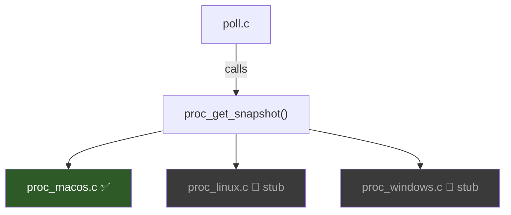
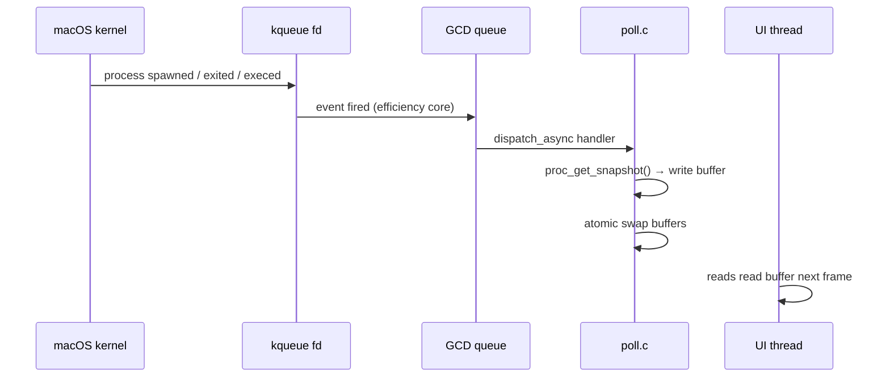
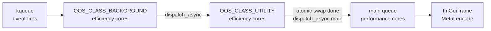
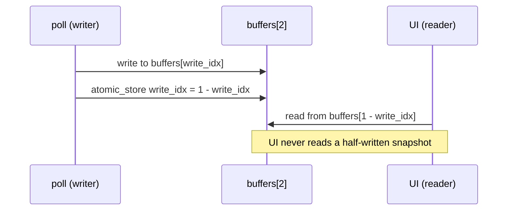
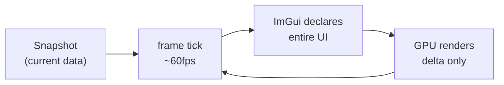
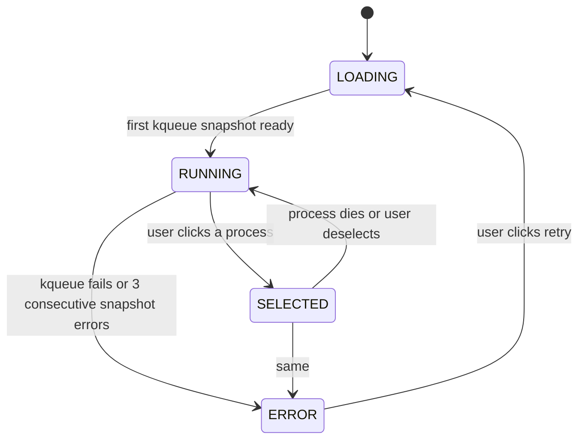
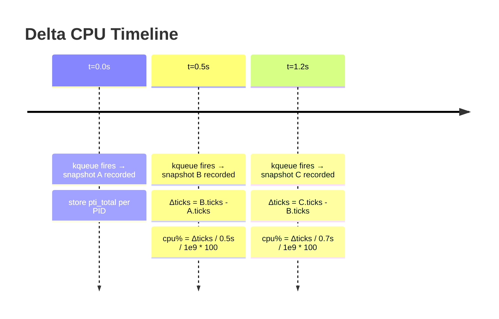
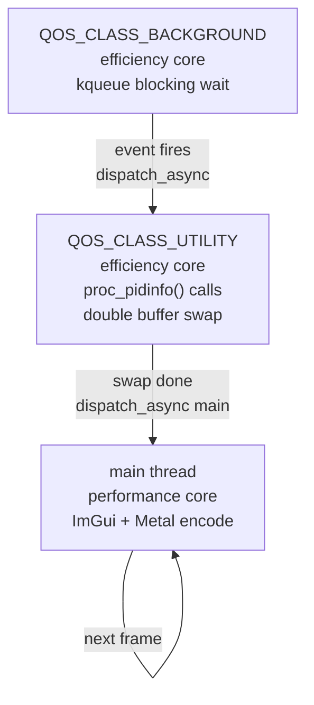
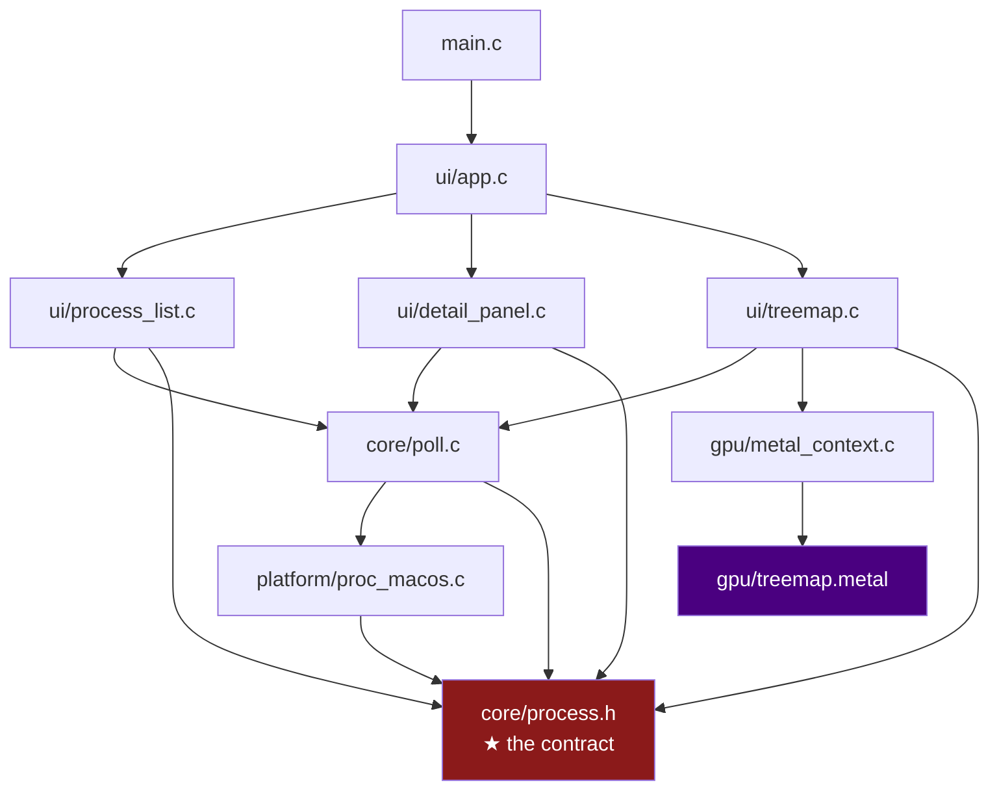

# PulsOS — Architecture Decision Record

> A living document. Every design choice here was made consciously.
> Read this when you're confused about *why* something is the way it is.
> The algorithms section explains the math in full — not just what we use but how it works.

---

## Table of Contents

- [PulsOS — Architecture Decision Record](#pulsos--architecture-decision-record)
  - [Table of Contents](#table-of-contents)
  - [System Overview](#system-overview)
  - [M4 Hardware Map](#m4-hardware-map)
  - [Active Patterns](#active-patterns)
    - [1. Platform Abstraction Layer](#1-platform-abstraction-layer)
    - [2. kqueue Push Model](#2-kqueue-push-model)
    - [3. GCD QoS Routing](#3-gcd-qos-routing)
    - [4. Double Buffering](#4-double-buffering)
    - [5. Ring Buffer for History](#5-ring-buffer-for-history)
    - [6. Immediate Mode UI](#6-immediate-mode-ui)
    - [7. Finite State Machine](#7-finite-state-machine)
    - [8. Metal Compute Layer](#8-metal-compute-layer)
  - [Algorithms In Depth](#algorithms-in-depth)
    - [Squarified Treemap](#squarified-treemap)
    - [Delta CPU Calculation](#delta-cpu-calculation)
    - [Shannon Entropy (future)](#shannon-entropy-future)
    - [Metal Color Mapping Kernel](#metal-color-mapping-kernel)
  - [Rejected Patterns](#rejected-patterns)
    - [Entity-Component System (ECS)](#entity-component-system-ecs)
    - [Observer / Event Bus](#observer--event-bus)
    - [Command Pattern](#command-pattern)
    - [500ms Timer Polling](#500ms-timer-polling)
  - [Data Flow](#data-flow)
  - [Threading Model](#threading-model)
    - [Strategy — compile-time OS detection, best primitive per platform](#strategy--compile-time-os-detection-best-primitive-per-platform)
    - [Apple (current) — GCD + QoS](#apple-current--gcd--qos)
    - [Linux / Windows (future) — pthreads](#linux--windows-future--pthreads)
    - [Why not just one thread?](#why-not-just-one-thread)
    - [Multithreading primitives — full comparison](#multithreading-primitives--full-comparison)
    - [What "core affinity" means here](#what-core-affinity-means-here)
    - [Pros and cons per option for PulsOS specifically](#pros-and-cons-per-option-for-pulsos-specifically)
    - [Summary](#summary)
  - [File Dependency Graph](#file-dependency-graph)

---

## System Overview

PulsOS is a live process monitor. Three layers, strictly separated:

```
┌─────────────────────────────────────────────────────────┐
│                      UI Layer                            │
│     process_list.c    detail_panel.c    treemap.c        │
└───────────────────────────┬─────────────────────────────┘
                            │ reads snapshot + history
┌───────────────────────────▼─────────────────────────────┐
│                     Core Layer                           │
│   poll.c — kqueue events · GCD dispatch · double buffer  │
└───────────────────────────┬─────────────────────────────┘
                            │ calls
┌───────────────────────────▼─────────────────────────────┐
│                   Platform Layer                         │
│   proc_macos.c — libproc fills Snapshot struct           │
│   proc_linux.c  — stub                                   │
│   proc_windows.c — stub                                  │
└─────────────────────────────────────────────────────────┘

┌─────────────────────────────────────────────────────────┐
│                      GPU Layer                           │
│   metal_context.c — device setup                         │
│   treemap.metal — color mapping kernel                   │
│   MTLBuffer — shared with CPU via unified memory         │
└─────────────────────────────────────────────────────────┘
```

**Rule:** UI never touches platform. Platform never touches UI. GPU layer is called only by treemap.c. poll.c is the only file that calls platform.

---

## M4 Hardware Map

Your machine: MacBook Air M4 2025 — 10-core CPU (4P + 6E), 8-core GPU, 120GB/s unified memory.

```
┌─────────────────────────────────────────────────────────┐
│                    Apple M4 SoC                          │
│                                                          │
│  ┌──────────────┐   ┌──────────────────────────────┐    │
│  │ Performance  │   │      Efficiency Cores         │    │
│  │   Cores (4)  │   │           (6)                 │    │
│  │  4.4 GHz     │   │        2.85 GHz               │    │
│  │              │   │                               │    │
│  │  UI thread   │   │  kqueue event loop            │    │
│  │  ImGui frame │   │  GCD background queues        │    │
│  │  Metal encode│   │  poll dispatches              │    │
│  └──────────────┘   └──────────────────────────────┘    │
│                                                          │
│  ┌──────────────────────────────────────────────────┐   │
│  │              GPU Cores (8)                        │   │
│  │   treemap.metal — color mapping kernel            │   │
│  │   render pass — box drawing + antialiasing        │   │
│  └──────────────────────────────────────────────────┘   │
│                                                          │
│  ┌──────────────────────────────────────────────────┐   │
│  │         Unified Memory (120 GB/s)                 │   │
│  │   CPU writes ProcessInfo[] → MTLBuffer            │   │
│  │   GPU reads MTLBuffer directly — zero copy        │   │
│  └──────────────────────────────────────────────────┘   │
└─────────────────────────────────────────────────────────┘
```

The fanless design means sustained GPU compute would throttle. This is irrelevant — the treemap kernel runs in microseconds, not continuously. PulsOS will never thermal-throttle the Air.

---

## Active Patterns

### 1. Platform Abstraction Layer

Each OS backend exposes one identical function:

```c
// proc_platform.h
int proc_get_snapshot(Snapshot *out);
```

CMake selects which `.c` file compiles based on target OS. Nothing else in the codebase ever `#ifdef`s for OS.



**Why:** You can rewrite `proc_macos.c` entirely without touching a single UI or poll file. The contract is the function signature.

**Alternative rejected — `#ifdef` in one file:** Readable at first, becomes a maintenance nightmare when each branch grows to 200 lines.

---

### 2. kqueue Push Model

Instead of polling every N milliseconds, we register `kqueue` filters and let the OS notify us when something changes.

```c
// register interest in all process events
struct kevent ev;
EV_SET(&ev, pid, EVFILT_PROC, EV_ADD,
       NOTE_EXIT | NOTE_FORK | NOTE_EXEC, 0, NULL);
kevent(kq, &ev, 1, NULL, 0, NULL);

// blocking wait — returns when OS fires an event
kevent(kq, NULL, 0, &event, 1, NULL);
```



**Why over polling:**
- Zero CPU when nothing changes — the efficiency cores sleep
- Catches processes that live and die within a 500ms poll window
- OS does the work of detecting change, not your timer

**What kqueue can watch:**
- `NOTE_EXIT` — process died
- `NOTE_FORK` — process spawned a child
- `NOTE_EXEC` — process called exec (became a different program)
- `NOTE_SIGNAL` — process received a signal

**Limitation:** You must register each PID individually. At startup you enumerate all PIDs via `proc_listallpids()` and register them all. New PIDs from `NOTE_FORK` are registered as they appear.

---

### 3. GCD QoS Routing

Grand Central Dispatch lets you declare the priority class of work. The OS scheduler maps QoS classes to core types on M4.

```c
// kqueue loop → efficiency cores
dispatch_queue_t eq = dispatch_queue_create(
    "com.pulsos.events",
    dispatch_queue_attr_make_with_qos_class(
        DISPATCH_QUEUE_SERIAL,
        QOS_CLASS_BACKGROUND, 0   // → efficiency cores
    )
);

// snapshot processing → utility level
dispatch_queue_t pq = dispatch_queue_create(
    "com.pulsos.poll",
    dispatch_queue_attr_make_with_qos_class(
        DISPATCH_QUEUE_SERIAL,
        QOS_CLASS_UTILITY, 0      // → efficiency cores, higher priority
    )
);

// UI always runs on main thread → performance cores
dispatch_get_main_queue(); // → performance cores
```



**Why this matters on M4:** The 6 efficiency cores run at 2.85GHz — plenty for `proc_pidinfo()` calls and buffer math. The 4 performance cores at 4.4GHz stay fully available for ImGui + Metal command encoding. No contention.

---

### 4. Double Buffering

Two `Snapshot` buffers. Poll writes to one, UI reads from the other. Swapped atomically.



```c
static Snapshot  buffers[2];
static atomic_int write_idx = 0;

// poll writes:
int wi = atomic_load(&write_idx);
proc_get_snapshot(&buffers[wi]);
atomic_store(&write_idx, 1 - wi);

// UI reads:
int ri = 1 - atomic_load(&write_idx);
const Snapshot *s = &buffers[ri];
```

**Why no mutex:** A mutex would block the UI thread if poll is slow. The atomic swap is lock-free — the UI either gets the old buffer or the new one, never a partial write.

**MTLBuffer variant for GPU:** The treemap color data uses a `MTLBuffer` with `MTLResourceStorageModeShared` — the same physical memory is visible to both CPU and GPU without any copy on M4.

---

### 5. Ring Buffer for History

Each tracked PID keeps a circular array of CPU% samples for sparkline rendering.

```
HISTORY_LEN = 60  →  30 seconds at 500ms effective update rate

Write head moves forward, wraps at 60:

index:  0     1     2     3    ...   59
       [0.1] [0.3] [0.8] [0.2] ... [0.5]
                    ▲
               history_head (next write position)

After write: history_head = (history_head + 1) % HISTORY_LEN
```

```c
typedef struct {
    float cpu_history[HISTORY_LEN];
    int   history_head;
} ProcessHistory;

// write:
h->cpu_history[h->history_head] = new_cpu;
h->history_head = (h->history_head + 1) % HISTORY_LEN;

// implot reads float* directly — no conversion needed
ImPlot_PlotLine("##cpu", h->cpu_history, HISTORY_LEN, ...);
```

**Memory:** 1024 PIDs × 60 floats × 4 bytes = **240KB**. Fits in M4 L2 cache entirely (64MB per performance core).

**Why not a linked list:** malloc per sample, pointer chasing per read, cleanup on process death. No benefit at this scale.

---

### 6. Immediate Mode UI

Every frame you declare what the UI contains. ImGui figures out what changed.

```c
// retained mode — you manage state explicitly:
void on_cpu_updated(float v) { label->setText(v); }

// immediate mode — just declare it each frame:
igText("CPU: %.1f%%", proc->cpu_percent); // that's it
```



**Why:** Live dashboards are a perfect match. No change events, no widget state sync. Pass the current snapshot, done.

---

### 7. Finite State Machine

The app has exactly four states. UI components gate rendering on state.



```c
typedef enum {
    STATE_LOADING,
    STATE_RUNNING,
    STATE_SELECTED,
    STATE_ERROR
} AppState;
```

Each panel checks state before rendering:
```c
if (poll_state() == STATE_SELECTED)
    ui_detail_panel(selected_pid);
```

**Why:** Eliminates scattered `if (pid != -1 && snap != NULL && loaded)` guards. One source of truth.

---

### 8. Metal Compute Layer

The treemap rendering uses a Metal compute kernel for color mapping. CPU computes rectangle positions (squarified algorithm, see below). GPU maps cpu% → RGBA heat color for each box in parallel.

```c
// CPU writes this to MTLBuffer:
typedef struct {
    float x, y, w, h;   // rectangle (normalized 0..1)
    float cpu_percent;   // 0..100
    float mem_bytes;     // for future use
} TreemapNode;

// GPU reads it, writes RGBA per node:
kernel void color_map(
    device const TreemapNode *nodes [[buffer(0)]],
    device float4 *colors           [[buffer(1)]],
    uint id [[thread_position_in_grid]]
) {
    float t = nodes[id].cpu_percent / 100.0;
    // cool (blue) → warm (red) heat map
    colors[id] = float4(t, 0.2, 1.0 - t, 1.0);
}
```

**Zero copy on M4:** `MTLResourceStorageModeShared` means the CPU-written `TreemapNode[]` array and the GPU-read buffer are the same physical memory. No `memcpy`, no DMA transfer.

---

## Algorithms In Depth

### Squarified Treemap

**Problem:** Given N processes with sizes (memory bytes), fill a rectangle such that each process gets area proportional to its size, and rectangles are as square as possible.

**Why aspect ratio matters:**

```
Bad (slice algorithm) — thin slivers are hard to click and read:
┌─┬─┬──────┬───────────────────┐
│ │ │      │                   │
│A│B│  C   │         D         │
│ │ │      │                   │
└─┴─┴──────┴───────────────────┘

Good (squarified) — readable, clickable boxes:
┌───────┬───────┐
│   A   │   B   │
├───┬───┼───────┤
│ C │   D       │
└───┴───────────┘
```

**The algorithm — step by step:**

Input: sorted list of values (largest first), a rectangle W×H.

```
function squarify(values[], rect):
    row = []
    for each value v in values:
        candidate_row = row + [v]
        if row is empty OR worst_ratio(candidate_row, rect) <= worst_ratio(row, rect):
            row = candidate_row        // adding v improves ratios → keep going
        else:
            layout_row(row, rect)      // adding v made it worse → commit row
            rect = remaining_rect      // shrink rect by committed row height
            row = [v]                  // start new row with v
    layout_row(row, rect)              // commit final row
```

**Worst ratio formula:**

For a row with sum `s`, largest value `rmax`, smallest `rmin`, strip width `w`:

```
worst_ratio = max(w² × rmax / s²,   s² / w² × rmin)
```

This captures both extremes — a huge value making a tall thin box, and a tiny value making a wide flat box.

**Concrete example:**

Values: `[6, 6, 4, 3, 2, 2, 1]`, rectangle `6×4 = 24`.  
Total = 24, so each unit of value = 1 unit of area.

```
Step 1: try row=[6], w=6, s=6, rmax=rmin=6
  worst = max(36×6/36, 36/36×6) = max(6, 6) = 6.0

Step 2: try row=[6,6], w=6, s=12, rmax=rmin=6
  worst = max(36×6/144, 144/36×6) = max(1.5, 0.67) = 1.5  ← better, keep going

Step 3: try row=[6,6,4], w=6, s=16, rmax=6, rmin=4
  worst = max(36×6/256, 256/36×4) = max(0.84, 1.78) = 1.78 ← worse! commit [6,6]

Commit row [6,6]:
  strip height = s/w = 12/6 = 2
  box A: x=0, y=0, w=3, h=2  (area=6)
  box B: x=3, y=0, w=3, h=2  (area=6)
  remaining rect: 6×2

Repeat for [4,3,2,2,1] in 6×2 rect...

Final layout:
┌───┬───┬──┬──┬─┐
│ A │ B │C │D │E│
│   │   ├──┼──┤ │
│   │   │F │G │ │
└───┴───┴──┴──┴─┘
```

**Complexity:** O(n log n) — dominated by the initial sort. The layout pass itself is O(n).

**C implementation sketch (~80 lines):**

```c
typedef struct { float x, y, w, h; } Rect;

static float worst_ratio(float *vals, int n, float w) {
    float s = 0;
    for (int i = 0; i < n; i++) s += vals[i];
    float rmax = vals[0], rmin = vals[n-1]; // pre-sorted
    float a = (w * w * rmax) / (s * s);
    float b = (s * s) / (w * w * rmin);
    return fmaxf(a, b);
}

void squarify(float *vals, int n, Rect rect, TreemapNode *out) {
    // ... recursive subdivision
    // see treemap.c for full implementation
}
```

---

### Delta CPU Calculation

Every OS gives cumulative CPU ticks since process start. You compute percentage from the delta between two snapshots.

```
cpu_ticks_per_second = (ticks_b - ticks_a) / elapsed_seconds
cpu_percent = cpu_ticks_per_second / ticks_per_second_total * 100
```

On macOS via `proc_pidinfo` with `PROC_PIDTASKINFO`:

```c
struct proc_taskinfo ti;
proc_pidinfo(pid, PROC_PIDTASKINFO, 0, &ti, sizeof(ti));
// ti.pti_total_user   — user space ticks (nanoseconds on macOS)
// ti.pti_total_system — kernel ticks (nanoseconds on macOS)

uint64_t total_ticks = ti.pti_total_user + ti.pti_total_system;
// delta between two snapshots:
uint64_t delta_ticks = total_ticks - prev_ticks;
double   delta_time  = current_time - prev_time; // seconds
float    cpu_pct     = (float)(delta_ticks / 1e9 / delta_time * 100.0);
```



Note: with kqueue the interval is variable (not fixed 500ms). Use actual elapsed time, not an assumed constant.

---

### Shannon Entropy (future)

Not used in v0.1 but worth knowing — it's how you'd add an "entropy column" to the process list, indicating how chaotic a process's CPU usage pattern is.

```
H = -Σ p(x) × log₂(p(x))
```

Applied to the ring buffer history:

```c
float entropy(float *history, int n) {
    // bucket cpu% into bins
    float bins[10] = {0};
    for (int i = 0; i < n; i++)
        bins[(int)(history[i] / 10.0f)]++;
    float h = 0;
    for (int b = 0; b < 10; b++) {
        float p = bins[b] / n;
        if (p > 0) h -= p * log2f(p);
    }
    return h; // 0 = perfectly steady, 3.32 = completely random
}
```

High entropy = erratic process. Low entropy = steady or idle. Useful for spotting misbehaving background processes.

---

### Metal Color Mapping Kernel

The heat color mapping runs as a parallel GPU kernel. Each thread handles one treemap node.

**Heat ramp:** blue (cold, 0% CPU) → green → yellow → red (hot, 100% CPU).

```metal
// treemap.metal
kernel void color_map(
    device const TreemapNode *nodes [[buffer(0)]],
    device float4            *colors [[buffer(1)]],
    uint id [[thread_position_in_grid]]
) {
    float t = clamp(nodes[id].cpu_percent / 100.0, 0.0, 1.0);

    // 3-stop gradient: blue → yellow → red
    float3 cold   = float3(0.2, 0.4, 1.0);  // blue
    float3 warm   = float3(1.0, 0.9, 0.0);  // yellow
    float3 hot    = float3(1.0, 0.1, 0.1);  // red

    float3 color;
    if (t < 0.5)
        color = mix(cold, warm, t * 2.0);
    else
        color = mix(warm, hot, (t - 0.5) * 2.0);

    colors[id] = float4(color, 1.0);
}
```

**Dispatch on CPU:**

```c
// nodes already in MTLBuffer (shared memory, no copy)
id<MTLComputeCommandEncoder> enc = [cmd computeCommandEncoder];
[enc setComputePipelineState:pipeline];
[enc setBuffer:node_buf offset:0 atIndex:0];
[enc setBuffer:color_buf offset:0 atIndex:1];

MTLSize grid = MTLSizeMake(node_count, 1, 1);
MTLSize group = MTLSizeMake(MIN(node_count, 64), 1, 1);
[enc dispatchThreads:grid threadsPerThreadgroup:group];
[enc endEncoding];
[cmd commit];
```

For 1024 processes all colors are computed in a single GPU dispatch — one frame.

---

## Rejected Patterns

### Entity-Component System (ECS)

Split `ProcessInfo` into separate flat arrays per attribute.

```c
// ECS — cache friendly for single-attribute ops
int    pids[MAX_PROCESSES];
float  cpu[MAX_PROCESSES];
size_t mem[MAX_PROCESSES];

// current — fat struct
ProcessInfo procs[MAX_PROCESSES];
```

**Rejected because:** At 1024 processes the fat struct fits in M4 L2 cache (64MB) entirely. ECS cache benefit requires tens of thousands of entities and SIMD ops across the data. Neither applies here.

---

### Observer / Event Bus

Central bus where components publish and subscribe.

```c
event_bus_publish(EVENT_PROCESS_DIED, &pid);
// all subscribers react automatically
```

**Rejected because:** Implicit control flow, hard to debug. With three UI panels the wiring is trivial to do directly. Worth revisiting if panels grow beyond ~6.

---

### Command Pattern

Every action is a struct that can be undone.

```c
typedef struct { CommandType type; int pid; } Command;
```

**Rejected because:** Heavy boilerplate in C. Only valuable with undo/redo or action replay. PulsOS has one destructive action (kill) and no undo requirement.

---

### 500ms Timer Polling

Simple `usleep(500000)` loop calling `proc_get_snapshot()` repeatedly.

**Rejected because:**
- Wastes CPU every 500ms even when nothing changed
- Misses processes that spawn and exit within the window
- kqueue is the correct macOS primitive for this exact use case

---

## Data Flow

```mermaid
flowchart LR
    kernel["macOS kernel"]
    kq["kqueue fd\n(efficiency cores)"]
    gcd["GCD\nQOS_CLASS_BACKGROUND"]
    macos["proc_macos.c\nproc_pidinfo()"]
    poll["poll.c\nΔcpu · swap · ring buf"]
    fsm["AppState FSM"]
    mtl["MTLBuffer\nshared memory"]
    gpu["treemap.metal\ncolor kernel"]
    list["process_list.c"]
    detail["detail_panel.c"]
    treemap["treemap.c\nsquarified layout"]

    kernel -->|"NOTE_EXIT\nNOTE_FORK"| kq
    kq --> gcd --> macos --> poll
    poll -->|Snapshot| list
    poll -->|ring buffer| detail
    poll -->|Snapshot| treemap
    treemap -->|TreemapNode[]| mtl
    mtl --> gpu -->|RGBA[]| treemap
    fsm -->|gates render| list & detail & treemap
```

---

## Threading Model

### Strategy — compile-time OS detection, best primitive per platform

PulsOS detects the OS at compile time via CMake and uses the most capable threading primitive available. No runtime detection, no abstraction tax.

```c
// poll.c
#ifdef __APPLE__
    // GCD — maps directly to P/E cores via QoS class
    #include <dispatch/dispatch.h>
#else
    // pthreads — standard on Linux, available on Windows via MinGW
    #include <pthread.h>
#endif
```

### Apple (current) — GCD + QoS

GCD lets the OS scheduler map work to the correct core type automatically. On M4 with 4 performance + 6 efficiency cores:



- **Main thread** — ImGui frame, Metal command encoding, FSM transitions
- **Background queue** — blocks on `kevent()`, zero CPU when idle
- **Utility queue** — `proc_pidinfo()` calls, delta CPU, buffer swap

Three queues, zero mutexes. The atomic swap is the only synchronization primitive.

### Linux / Windows (future) — pthreads

pthreads is POSIX standard on every Unix-like OS and available on Windows via MinGW/pthreads-win32. Same logical structure — two background threads replacing the two GCD queues.

```c
// equivalent pthread structure for Linux backend
pthread_t event_thread; // blocks on inotify /proc events
pthread_t poll_thread;  // does /proc/<pid>/stat reads

// same double buffer atomic swap — no mutex needed
atomic_store(&write_idx, 1 - wi);
```

**Why not SDL_Thread:** SDL2 ships cross-platform threading via `SDL_Thread`. Valid option but adds SDL dependency to `poll.c` which should stay UI-library-agnostic. pthreads keeps the core layer clean.

**Why not C11 `_Thread`:** MSVC support is incomplete. pthreads-win32 is more reliable in practice for Windows builds.

### Why not just one thread?

A single-threaded design would call `proc_pidinfo()` on the main thread, blocking ImGui for however long the syscall takes. On a busy system with 500+ processes that's measurable latency — the UI stutters. Separate threads keep the UI frame budget clean.

### Multithreading primitives — full comparison

| Primitive | Platforms | Core affinity | Overhead | Notes |
|---|---|---|---|---|
| **GCD + QoS** | Apple only | ✅ P/E core routing | Near zero | Best option on Apple silicon |
| **pthreads** | Linux, macOS, Windows (MinGW) | ❌ manual `pthread_setaffinity_np` | Low | POSIX standard, reliable everywhere |
| **C11 `_Thread`** | Linux, macOS | ❌ no affinity API | Low | MSVC support incomplete — avoid for Windows |
| **SDL_Thread** | All | ❌ no affinity | Low | Would pollute `poll.c` with UI dependency |
| **Win32 threads** | Windows only | ✅ `SetThreadAffinityMask` | Low | Too platform-specific, symmetric with nothing |
| **OpenMP** | All (with compiler support) | ❌ data parallel only | Medium | Wrong model — designed for parallel loops, not event loops |
| **C++ std::thread** | All | ❌ no affinity | Low | C++ only — we're writing C |

### What "core affinity" means here

On a heterogeneous chip like M4 (4 fast + 6 slow cores), you want:
- **Heavy UI work** → performance cores (4.4GHz, large L2)
- **Idle waiting + light syscalls** → efficiency cores (2.85GHz, saves power)

GCD QoS does this automatically. pthreads can do it manually via `pthread_setaffinity_np` on Linux, but it requires knowing core topology at runtime and is fragile. On Linux all cores are typically the same speed anyway so it doesn't matter.

### Pros and cons per option for PulsOS specifically

**GCD (Apple)**
- ✅ OS handles core routing — zero code for P/E split
- ✅ No mutex needed with double buffer
- ✅ `dispatch_async` block syntax is clean
- ❌ Apple only — can't use on Linux/Windows

**pthreads (Linux/Windows)**
- ✅ Universal, well documented, battle tested
- ✅ Same double buffer atomic swap works identically
- ✅ `pthread_create` is straightforward
- ❌ No automatic core type routing
- ❌ More boilerplate than GCD blocks

### Summary

| OS | Primitive | Core routing |
|---|---|---|
| macOS | GCD + QoS | OS maps to P/E cores automatically |
| Linux | pthreads | OS scheduler, no core type distinction |
| Windows | pthreads-win32 | OS scheduler |

---

## File Dependency Graph



`process.h` is the foundation — if its structs change, everything recompiles. Design it carefully. It is the first file we implement.

---

*PulsOS — Felipe Carvajal Brown · M4 MacBook Air · plain C + Metal*